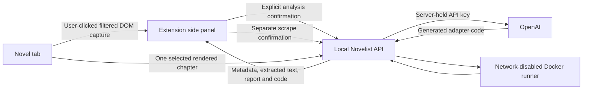

# Novelist Browser Extension

The first version is an unpacked Chrome/Edge desktop extension. It identifies a novel page,
shows translated metadata and candidate chapter links, explores approved browser navigation, and runs
a small scrape test only after confirmation. It saves independent source books and supports explicit
all/range downloads. It is not a browser-store release, Safari/Firefox extension, or unattended crawler.

## Setup

Keep Docker Desktop running. Start Novelist and local Supabase:

```sh
npm run db:start
npx supabase migration up --local
npm run dev -- --host 127.0.0.1
```

The extension and sandbox have already been built in this workspace. To rebuild after changes:

```sh
npm run scraper:setup
npm run build:extension
```

The build uses the installed Playwright Chromium to generate bitmap toolbar icons. On a fresh
machine, run `npm install` and `npx playwright install chromium` before building. There is no
model call during the build or automated extension tests.

1. In Chrome open `chrome://extensions`, or in Edge open `edge://extensions`.
2. Turn on Developer mode and choose Load unpacked.
3. Select the `dist-extension` folder at the root of this project, not the source `extension` folder.
4. Pin **Novelist Page Reader** in the browser toolbar.
5. Open a novel's index or chapter page and click the Novelist toolbar icon. The side panel opens
   and captures that tab locally. It does not send anything to OpenAI yet.
6. The panel connects automatically to the configured local app, by default `http://127.0.0.1:5173`.
   No connection-approval click is required for this personal/local setup.
7. A temporary inactive Novelist tab uses the existing library session in this browser, completes
   the handshake and closes itself. The novel tab stays selected.

The same address, port, and browser session must be used for pairing. If Vite selected another
port, set that address in the extension's connection settings first. Novelist has an anonymous
library per browser origin: your regular Chrome library may differ from the VS Code browser's
library. Save actions apply only to this browser's library at the configured app origin, not another
browser's library. Auto-connect does not replace authentication with a shared or service-role identity.

Connections still last 30 minutes and are held in memory/session storage. While the panel is open,
it checks the backend every 30 seconds, renews a nearly expired connection when idle, and reconnects
after expiry or a server restart. Opening the panel also checks immediately. A missing backend shows
a connection error; pending connection tabs time out after 20 seconds. Reconnection does not replay
model requests, scraper jobs or saves. In-memory jobs lost during a server restart remain unavailable.

**Disconnect**, under the settings gear, pauses automatic connection persistently. **Connect to
Novelist** resumes it and can use a corrected local address. After rebuilding, click Reload for the
extension on the extensions page and reopen its panel. Identification starts directly when you click
Analyze page, without an additional checkbox. Scan & save chapters is the explicit command to navigate
the contents and save its links. Chapter extraction tests retain separate confirmations; automatic
connection itself does not make a paid model call. Reading-edition pairing controls are removed.

## Reading a Page

1. Visit a book index or content page and click the toolbar icon. This grants access to that tab
   through Chrome's `activeTab` permission, not permanent permission to read all websites.
2. Review the page title and site. **Captured page** contains the capture size and preview of the first
   5,000 text characters; analysis uses the complete filtered HTML capture, up to the configured limit.
3. In the **Settings** tab, choose **Output language** (English by default). This controls the translation of the returned
   information, not the source language. The model automatically detects the page's source language.
   Choose **Analysis model** to override the server default for this request. **Use as default**
   remembers that model in this browser; another one-off selection does not change that preference.
   **Estimate costs** provides a local token estimate and model-price comparison without a model call.
4. Choose **Analyze page** to send the captured page to OpenAI. No additional checkbox is required.
   The **Metadata** tab contains the translated title, author, synopses, cover and separate **Source language**.
   Initial identification trusts the model's structured result without requiring evidence quotes or
   exact source-string matches. Unsafe or off-page navigation is still filtered before sampling.
5. In **Chapters**, choose **Scan & save chapters**. It opens the detected same-site contents URL, activates clear
   expand-all, load-more, ascending-order and next-contents-page controls, and gathers links in batches
   of 500. It uses no model call and does not capture chapter bodies. The identified novel and links
   are saved to Novelist, or its existing source is updated without a duplicate. Found/reported counts,
   partial-list warnings and save errors remain visible. **Stop scan** cancels further navigation.
   If analysis omitted the contents URL, the scanner follows an observed complete-contents link
   from the landing page first, including Chinese labels and common translated directory/catalog labels.
6. Search the full discovered list with **Find a chapter**, select **Chapter**, and choose
   **Download chapter**. The selected download method fetches the URL directly or opens the source
   tab for rendered capture, then saves text to the paired source's private storage. A saved scraper is tried first; generation/repair requires
   separate confirmation for up to three model calls. Return to Novelist to read the stored text.
   A reader waiting on browser capture checks for the saved text when you return; **Check saved
   chapter** does the same manually, without repeating the blocked HTTP request. For a paused
   range, choose **Resume downloads** once the chapter is saved. The extension and app must use
   the same browser library session. Scanning links and testing extraction do not save chapter text.
   The adjacent **Test chapter extraction** icon remains available with a tooltip; it tests without
   saving text and exposes the extraction report. Only chapter-text extraction can pass, not an index.
   Its dialog offers **Page access > Direct URL fetch** or **Rendered browser page**, and **Rebuild
   cached scraper** to force a fresh extractor. Rebuilding still needs the permission checkbox and
   up to three billable requests. A replacement is cached only after validation; saved chapters are
   not rewritten. Direct tests pass only fetched chapter HTML to the model/sandbox, not the index page;
   failed fetches and detected challenges stop before model use. The server fetches; generated code
   remains network-disabled. A successful direct test selects direct downloads for this site.
7. There is one **Open in Novelist** link. **Add book to library** saves this reading source as its own
   book. **Metadata > Novel Updates** accepts a series URL, before or after saving the book.
   This attaches catalog metadata only and makes no model call. **Analyze again** is in Settings.
8. **Your library** lists books with visible source URLs. Exact source/contents URLs restore their
   book without title matching. Edition-pairing controls are removed. When viewing Novel Updates,
   **Attach Novel Updates** can attach the catalog to one or more books without merging them.

Each reading source now has a separate library book. Existing multi-source novels were migrated while
preserving source IDs and downloaded text. For translation, choose another library book as context
inside Novelist. The current reader/folder/guide workflow is described in the [README](../README.md#translate-and-read).

Already-linked directories do not need another AI analysis when their saved chapter inventory is
empty. The extension observes the rendered chapter links locally and shows them in the picker.
Single and bulk downloads save that verified inventory before opening a chapter; a failed save
stops the download and keeps the directory open. Paginated directories still need **Scan & save
chapters** to collect the complete list. AI-only candidate links are not sufficient for download.

Novel543 check on 2026-09-11: the linked `/0214633001/dir` source had no saved inventory, despite
754 unique chapter links in the live DOM. Identification had labeled the page `catalog` and returned
no chapter links. The first chapter also loaded through the guarded direct fetcher with no detected
challenge. Navigation now accepts a stable, matching interactive document while background resources
are still loading; URL and challenge checks remain enforced. After pausing any active batch, reload
the unpacked extension, refresh the directory and click the toolbar icon. Its existing pairing is
reused. Downloading saves the observed links first; a new site's first scraper still needs explicit
generation approval. No real chapter extraction or paid generation was performed during this check.

Analyze page is one billable model request and does not start scraping. The confirmed test can
reuse a saved site scraper with no model call, or make up to three billable requests when generation
or repair is needed. Merely
opening the panel, capturing locally, connecting, changing selection, or cancelling confirmation
does not make an AI request. These operations require the local server key and live-AI setting:

```dotenv
OPENAI_API_KEY=your_key_here
NOVELIST_ENABLE_LIVE_AI=true
OPENAI_IDENTIFICATION_MODEL=gpt-5-nano
OPENAI_SCRAPER_MODEL=your_available_compatible_model
```

Keep the key in the ignored `.env.local` on your machine. Do not put it in the extension or a
`VITE_` variable. Restart Vite after changing these settings. The configured model must support
Responses structured output and the generator's reasoning setting. Identification defaults to
GPT-5 nano independently of the scraper model, uses minimal reasoning, and does not retry with a
more expensive model automatically. Model-metadata access to GPT-5 nano was checked for this local
account, but that does not establish translation quality or a successful live identification.

### Bulk Downloads

After saving the source book and scanning its contents, choose **Download method** beside the chapter
picker in **Chapters**, then use the visible **Bulk downloads** section. Choose **Download all**,
or enter **From** and **To** and choose **Download range**. The range is inclusive and uses positions
in the full deduplicated inventory, not the current chapter search results. All means every indexed
chapter, up to the scanner's 20,000-link limit; it cannot include undiscovered pages from a partial scan.

Chapters, Metadata and Settings are separate views, not collapsed panels. Switching tabs leaves
download state intact. When deploying hosted Supabase, the plan keeps this ingestion bridge local
to the Mac and connects it to the same private hosted library as the phone; see the
[hosted migration plan](deployment.md). That hosted connection is not configured yet.

**Download method** selects **Direct URL fetch** or **Rendered browser pages**, saved per exact site
origin and shared by single and bulk downloads. Direct mode submits each saved URL to an asynchronous
server download job, reuses the site's extractor, and does not navigate or capture any chapter tabs.
Browser mode opens one chapter at a time in the source tab and saves validated rendered text to that
source. Already stored URLs are skipped before either fetch or browser navigation. Progress distinguishes newly saved
chapters from those already saved. No title-based merging happens across chapters or sources.
**Pause downloads** stops after an in-flight extraction finishes; **Resume downloads** continues from
the checkpoint. Failed access, unexpected navigation, network errors and missing scrapers pause the
batch without discarding completed chapters. The batch stays bound to the captured source and library.
Pause before changing download methods; once any in-flight job finishes, switch and resume the same
pending chapter. A direct failure does not automatically switch modes or open a browser tab. After
updating the extension, existing successful tests from an older build may require selecting Direct URL
fetch manually; rebuilding the scraper again is unnecessary.

**Seconds between chapters** is saved per site (1-60 seconds). Detected browser verification pauses
before extraction, keeps the current chapter pending, and raises pacing to at least five seconds
(doubling after repeated challenges, capped at 60). **Show source tab** opens the tab for manual
resolution, then **Resume downloads** continues. No verification controls are clicked automatically,
and changing browser automation tools is not a solution to an access restriction. Slower pacing may
help a site's request limits but is not guaranteed to prevent challenges.

**Download timings** separates average browser navigation/capture time from extraction/save job time
(including polling). These measurements support subsequent bottleneck analysis. Production batches
remain sequential in both modes; direct mode reports zero browser captures. Experimental parallel workers are limited to the local fixture
benchmark described in [translation-plan.md](translation-plan.md#download-experiments).

An observed redirect between extensionless and `.html`/`.htm` forms of the same path can continue only
when both URLs are already present in that source's inventory and origin, query and hash are unchanged.
The server independently validates it, records a source-specific alias, and deduplicates the saved
inventory and pending queue. Subsequent scans reuse that alias. Redirects to a different chapter,
unlisted destination, another site or a changed query remain blocked; errors show requested and
opened URLs. The browser driver also waits for the observed document URL to match the navigated tab
before accepting it as settled.

The reported 101kks 755-entry batch contained both `/txt/11508/5695534` and
`/txt/11508/5695534.html` as chapter one. On 2026-09-11 the browser confirmed the former redirects
to the latter, and the corresponding saved inventory was repaired to 754 entries. No chapter text,
translation or source pairing was replaced. This is observed canonicalization, not guessed URL rewriting.

Each missing/failed scraper requires its own **Review model use for chapter** confirmation, permitting
up to three model calls for that chapter only. It does not authorize paid work for every remaining
chapter. Pending extraction jobs are polled, not resubmitted on a slow response. If the local server
loses a job, the queue pauses and checks stored results on explicit resume; paid requests are not
automatically replayed. Completed server jobs are released as they are consumed.

Keep the source tab, local app and Docker running. The queue survives closing/reopening the panel
and a worker restart within the current browser session. Restarting the browser, reloading the
extension, changing the captured source or disconnecting can clear the queue. Start the same range
again to skip completed chapters. It is not a persistent cross-device or unattended download scheduler.
Existing per-chapter text, pagination and access-review limits still apply.

### Contents and Reading Order

Identification returns representative chapter links, which may come from a latest-updates section.
Its reported chapter total is not a count of links the model has actually enumerated. Scanning the
contents page distinguishes these values: **chapter links found** versus **chapters reported by the site**.

The browser captures a bounded navigation list, and shared local code groups chapter URLs, removes
duplicates, and recognizes ordinary Arabic/full-width numeric chapter labels. It detects oldest-first,
newest-first, mixed or unknown source order. The picker and bulk queues deduplicate by normalized URL,
as do outgoing inventory saves and server processing. Plain page fragments are removed; meaningful
query parameters and SPA routes stay distinct. Duplicate links retain the better numbered chapter
label rather than an earlier Read first label. Numbered chapters are sorted numerically, with recognized
prologues first and final chapters/afterwords last. The scan does not sort by internal URL IDs. It keeps
original labels in JSON and uses readable generic labels such as Chapter 1 in the interface.

The scanner follows clear contents controls, but cannot guarantee coverage of arbitrary sites. Unvisited pagination links, capture limits,
or a found count below the reported total produce a partial-index warning. Counts refer to distinct
links; split chapters can have more links than chapter numbers. Unsupported numbering and plain
un-numbered titles may retain uncertain order. The capture is capped at 20,000 links and 1,500,000 combined
label/URL characters; clipped captures are marked. Scanning transfers links in batches of 500
and combines visited pages within the same limits. More contents pages and virtualized links may still need
additional capture. The searchable single-chapter selector includes the entire discovered list, not
just the first 12 entries. Matching the reported count is useful evidence, not proof of source completeness.

The scan deliberately uses the browser's loaded DOM, which is useful when a site rejects cookie-free
server requests. It does not bypass login or access restrictions. The toolbar's temporary same-site
permission is required; if the captured tab was closed or changed to another site, return to the novel
and click the extension icon again. The contents-heading external-link icon opens the contents manually.

### Scan Controls

The primary scanner is deterministic, bounded at 40 observed actions/four minutes and the link/text
limits above. It does not use paid navigation planning, write selectors or evaluate model-generated
code. Same-origin, registered-control, blocked-page, stale-state, no-progress and cancellation checks
remain in effect. Unknown controls or virtualized lists may still need manual navigation and another scan.
Landing-page contents discovery does not depend solely on the model's `indexUrl`. The scan follows
clear, unvisited, same-origin complete-contents controls before expanding the index. It retains that
index URL and marks a below-reported-count result partial even when no further controls are available.
Chapter-list pagination also follows observed JavaScript **Next** / **Next page** controls without
requiring a destination URL. Comment/review controls are excluded from both discovery and cached
navigation. No-progress, same-site and action limits still apply.

Successful, nonpartial scans save the controls that changed the page as site-navigation recipes in
Supabase. Reuse is global across this library's novels on the exact origin, not shared across owners.
Recipes contain normalized labels, control roles, select values and navigation intent, not book-specific
URLs or executable code. Changing chapter counts in a label does not prevent reuse. Every action must
still match a currently observed control and pass the same safety checks. A cached action that makes
no progress is invalidated, and ordinary discovery is attempted instead. Successful replacement recipes
are saved for the next scan; missing controls are skipped. This cache makes no model requests.

Clicks are validated in the isolated content script. A one-time marked element is then rechecked and
clicked by fixed extension code in the page's MAIN world. This lets the site's JavaScript-backed
expand links run normally; arbitrary model code never enters the page. Decisions cross the injection
boundary as JSON to preserve required null values, and action failures return to the worker instead
of becoming silent page exceptions. The prior model-driven exploration engine remains internal, but
its separate exploration/sample controls have been removed from the main panel.

#### Observed Public Indexes

On 2026-09-10, the built DOM registry and batch collector were exercised in the browser on
`https://101kks.com/book/11508/index.html`, reached from `https://101kks.com/book/11508.html`.
The initial list exposed 36 chapter URLs. Clicking the site's Expand all 754 chapters control exposed
**754 distinct chapter URLs**, transferred in **two batches**, starting with chapter 1 and ending with
chapter 752, the final chapter and the afterword. No chapter bodies were fetched and no model calls were
made. This validates the link inventory at that time, not chapter-text quality or autonomous model choices.
After the simplified scanner was implemented, the actual shared scan function was rechecked on the
live page: **36 initial links -> 754 distinct chapter URLs**, **one expansion action**, **two batches**,
not truncated, zero model calls. The installed-extension test separately exercises expand-all from
the isolated script, automatic link import and one selected chapter on a synthetic site.
The user's later identification had `indexUrl: null`, so the earlier scanner stayed on the landing
page. The installed-extension regression now starts with six latest-update links and no index URL,
follows Complete directory, expands the index and saves all 754 chapter URLs in two navigation actions.
The live landing-to-index control route was also rechecked, with 754 URLs collected and no model call.

The separate `https://0f0d2.bqg413.cc/#/book/117659/` investigation exposed 7,805 distinct chapter URLs
after clicking Ascending, while the final numbered label was 7,850. Last chapter number and link count
are not interchangeable. Both observations use ordinary public page controls, without bypassing access checks.

On 2026-09-11, Freewebnovel's `new-ability-every-ten-days-becoming-a-vampire-made-me-too-op`
index initially exposed 46 distinct links: 40 table entries plus six latest chapters. Its JavaScript
**Next** control has no navigable URL, which the earlier scanner required. The registered DOM controls
were checked on the live page through ranges 1-40, 41-80, 81-120 and 121-122, ending with **None**.
No chapter bodies or model calls were used. A separate installed-extension regression collects all
122 fixture links, excludes **Load More Comments**, saves to an already-paired edition without adding
a book, and repeats the scan using the saved navigation rule. A normal live browser click also caused
an advertising redirect; scans still stop if the source tab leaves the approved site.

Duplicate chapter URLs now prefer a numbered chapter title over an earlier **Read first** / start-reading
label in DOM capture, multi-page merging and inventory discovery. Previously chapter one could appear
as an unnumbered entry at the end of both source inventories. Refresh and rescan to update saved labels;
chapter URL identity and existing pairings are preserved.

After updating the extension, reload it and refresh the source page to start at the first table page,
then choose **Scan & save chapters**. Existing pairings are reused; neither pairing nor analysis needs
to be repeated when the saved source is recognized.

### Earlier Pairing Workflow (Historical)

The edition-pairing UI described in this section has been superseded by independent source books.
Use Reading a Page above for the current workflow; the legacy backend contracts remain for compatibility.

**Pair version** records a URL, language and label, up to five links per capture. English is the default
edition language. These are user-supplied relationships, not automatic identity matches. The model is
told the translated pages' content is not provided; it cannot quote or learn translation style from
a URL alone. Import an authorized EPUB/TXT in Novelist and choose it under Translation > Setup to
use its stored text as a reference. Fetching reference chapter bodies from linked sites is still pending.

The paired URLs are persisted as reference sources under the same canonical novel when you save.
Removing a context link affects the current capture, not an already saved source relationship.
Subsequent saves add/deduplicate linked versions; they do not silently delete existing editions.

**Scan & save chapters** requires a stored identification and uses its title and author when registering
a new novel. The optional **Save metadata only** dialog permits manual corrections. The transaction creates a `WEB` book, canonical novel, source record, metadata snapshot,
optional discovered contents and paired references. Existing files and reading progress are untouched.
The same canonical contents/source URL maps to the same owner-scoped web-book ID. Re-adding does not
overwrite metadata; the saved-metadata pencil opens an explicit replacement dialog. Original identification
records and raw extraction JSON remain available for provenance.

**Open in Novelist** opens the saved book in the connected library. It appears in the library grid/table,
and the app refreshes non-reader views when you return to its tab. The book page shows the translated
synopsis, discovered external chapter links and a **Translated versions** section. **Open source** opens
the original site. No downloadable book or readable local chapters are fabricated: the page states that
chapter text is not downloaded. An imported EPUB/TXT is not automatically merged merely because its
title resembles this web entry.

When you reopen a captured URL that exactly matches a saved source or contents URL, the extension
shows **In your library** before another analysis. It refreshes source associations on panel
open and restores a saved identification and contents when available. Same-host or similar-title
matches alone never select a book automatically; ambiguous existing sources require review.

After **Scan & save chapters** finishes with usable links, the inventory is saved to that existing source,
or a new identified novel is registered if the source is not already linked.
A WEB book's original-source scan also updates its existing Contents list; translated-source inventories
stay separate. Files, chapter text, title, language and reading progress are not replaced. A shorter
inventory will not overwrite a longer one. Save failures retain captured links with **Retry saving**.
Cancelled or failed navigation does not auto-import. Partial results from a bounded completed scan
may be saved, clearly marked; the source table and book catalog retain the truncated flag.

Repeated adds of a known edition return the existing novel, and a database guard rejects creating a
second WEB book for an already-linked source. No existing duplicate books are merged or deleted.

### Earlier Translation Setup (Historical)

In Novelist, open the saved book's **Translation > Setup**. Each reading source has its own link
inventory and count. **Main chapter source** chooses which inventory appears in the translation
chapter selector; it does not flatten editions with different counts or replace the reader's files.
Choose a **Target language** and a **Main-page metadata** source independently. A linked Novel Updates
catalog is available for metadata, not as a chapter-reading source.

Use **Preview source metadata** to review the saved identification without another model call, or
confirm **Translate title and synopsis**. **Apply to book page** explicitly changes the display title,
synopsis, author and available cover while preserving original source metadata and reading progress.
Adding a source URL alone does not provide a metadata identification; analyze and attach it first.

**Reference source** selects another paired reading source, with imported reference books retained as
an alternative. The app offers range downloads (first five positions by default), desktop side-by-side
review and editable split/merged pairs. Optional **Suggest matches & terms** compares selected stored
texts in one confirmed cheap-model request; exact bilingual evidence is checked before saving proposed
matches and glossary terms. Review pairings and approve terms before source-to-source translation uses
them. **Preview translation context** is free; **Translate chapter draft** is separately confirmed.
Saved settings and metadata controls collapse to keep chapter work prominent; phones focus on reading
and translation. Generated draft download is still separate from publication into the reader.

Chapter rows now open Novelist's reader and download missing text through direct HTTP first. On the
2026-09-11 access check, Freewebnovel accepted direct fetching, while 101kks returned HTTP 403. If direct access
fails, open the paired source in this extension and download the selected rendered chapter instead.
The app and extension share source-owned text; neither creates a duplicate book. Source navigation,
downloads, metadata catalogs and model tests have distinct tooltip descriptions. No paid model call
was made during automated verification of this workflow.

### Earlier Library Matching (Historical)

**Sources** in Novelist's main navigation lists saved original sources, catalog contents URLs and
translated-version URLs, with search and links back to their books. It reads the existing owner-scoped
catalog; opening it makes no source-site fetch or model request.

The extension's **Your library** tab reads the connected local app's library in this browser. Search covers
titles, original titles, confirmed aliases, authors and source URLs. Exact saved URLs are marked Linked.
Local possible matches use titles, aliases and authors, so browsing and these suggestions are free of
model calls. The full list remains available for manual selection even when no match is suggested.

**Compare across languages** is optional and explicitly consented. One request sends the identified
page metadata and bounded titles, authors, aliases and short synopses for up to 60 library books. Local
candidates are prioritized when the library is larger; the result reports how many books were compared.
The selected comparison model considers translated title meanings, author variants and distinctive
synopsis details. It returns only supplied book IDs with reasons, not calibrated probabilities. The
comparison does not fetch English websites, send chapter files, or merge books. Usage and estimated
cost are shown when the provider returns them. Automated checks mock the provider; cross-language
matching quality has not been benchmarked on live Freewebnovel pages.

After identification, **Pair** is available on suggested books and in the searchable full list. Review
the destination novel, URL, edition label, detected website language and original/reference role, then
choose **Confirm pairing**. This uses a transaction under the connected owner's RLS session. It adds
the source, retains the identification relationship, and learns the confirmed titles as aliases, without
replacing the book's title, author, language, files or reading progress. Repeating the same pairing is
idempotent. A URL already linked to another canonical novel is rejected; this is not a book-merging tool.
No new `WEB` book or chapter text is created by pairing. Translated-version relationships appear in the
book page and global source directory after refresh. A failed save leaves the review form open.

### Earlier Captured Metadata (Historical)

Novel Updates series pages are metadata catalogs, not direct chapter indexes. They can supply
Associated Names, Chinese/original titles when present, author variants, original and English
publishers, year, licensing/translation status and synopses. The analysis prompt retains aliases in
their written languages, and the result shows them in a dedicated Aliases section. It does not invent
a Chinese source URL when only a Chinese title is present. Website language still describes the
primary page's language; an original-novel language attribute is separate metadata.

To include a catalog page while analyzing an original or translation site:

1. Open the complete Novel Updates series page normally and capture it with the extension toolbar.
2. Choose **Keep metadata reference**. This keeps one filtered capture in the extension session,
   without a model call. Security-verification pages are rejected as references.
3. Return to the original or translated novel page and capture it. Check **Include this metadata
   reference in analysis** after verifying the displayed reference belongs to the same novel.
4. Review **Estimate costs**, then choose **Analyze page** to send the primary capture and selected reference.
   The reference HTML, not merely its URL, is included in that single identification request.

The reference remains available across page changes, but inclusion resets to off when a new page is
captured. **Remove metadata reference** clears it. Local cost estimates include both captures.
The normal per-page limit is unchanged: at most 80,000 filtered HTML characters each, 160,000 combined.
For Novel Updates, capture is scoped to the observed series-content block, excluding reviews, page
chrome and hidden editing hints instead of raising the limit or silently clipping the page.

Aliases are used in local matching and the optional cross-language comparison. Reviewed saving or
pairing preserves aliases under the canonical novel and keeps the Novel Updates URL as a **Metadata
catalog** source, distinct from original sources and translated editions. Its URL, title and capture
hash remain associated with the saved identification. Publication attributes remain in the structured
metadata and raw extraction JSON. You can also analyze a Novel Updates page directly, then pair it to
an existing book from **Your library**, with Metadata catalog selected as the source role.

To attach Novel Updates to a book already in your library: capture the Novel Updates series page,
click **Analyze page**, then **Attach catalog to existing novel**. Select the destination book in
Your library, click **Pair**, review the Metadata catalog role and choose **Confirm pairing**. Do not
use Save metadata only for this workflow. **Keep metadata reference** by itself only retains the capture
for use in another analysis; it does not attach it to a saved novel.

Observed publisher, translation-group and related-site URLs are displayed as metadata links. Visible
release redirects may be retained with that label, but are not followed automatically, passed to
chapter scraping or counted as a chapter inventory. Primary-site counts remain distinct from catalog
counts; disagreement is retained as source-labeled metadata rather than silently resolving it.

The supplied series page was checked in the ordinary browser on 2026-09-10. A direct request returned
HTTP 403; the browser initially showed verification and subsequently loaded without an automated
challenge interaction. The rebuilt scoped capture contained **20,273 characters** and retained four
associated names, including **The Light-Devouring Vampire** and the Chinese title. The visible author
was Three Lifetimes of Dao, the original publishers were Qimao and Zongheng, and the English publisher
was Wuxiaworld. The catalog reported **753 chapters, completed**, year **2024**, and translation not
complete. This is separate from the **754 distinct URLs** observed in the 101kks index, which includes
the final chapter and afterword. No chapter bodies or paid model calls were used for these checks.
Live model extraction/identity quality remains unbenchmarked; the metadata workflow tests use synthetic
captures and mocked provider responses.

### Metadata and JSON

The selected output language applies to title, author rendering, synopsis labels/text, chapter
labels, genres, tags, status, reason, image alt text and additional fields. English is the default;
source language detection is automatic and recorded separately as a BCP-47 code such as `zh-Hant`.
There is no manually supplied source-language hint. Original title, author and synopsis text stay
in the extraction JSON. The original capture preview and scraped chapter text are still source
material, not full chapter translations.

Each distinct visible synopsis or introduction is retained as a separate entry. The model maps
observed counts, status, update date, genres and tags to known fields, and preserves unmatched
attributes in `additionalMetadata`. Cover URLs are extracted from HTML, including lazy image URLs;
image pixels are not sent to the identification model. Cover display loads the image from its host
without a referrer. This first version stores the URL, not a private copy of the image file.

Successful results are saved to the owner-isolated `page_identifications` table in Supabase, with
structured fields, metadata JSON, raw extraction JSON, source/output languages, prompt/model version,
HTML hash and usage. They do not automatically create a book. **Identification JSON** downloads the
result, originals, extra fields, cost information and saved record ID. A storage failure leaves the
result available for download and shows a warning instead of discarding the model response.

Identification filenames include a shortened novel title, source hostname and short record ID, such
as `novelist-identification-the-river-ledger-books-example-test-195683d2.json`. Original-language
titles are preserved; missing titles fall back to the URL path. Unsafe filename characters are
removed, and URL credentials/query parameters are not included. Full values remain inside the JSON.

### Cost Comparison

HTML characters are not tokens or a monetary charge. **Estimate costs** tokenizes the captured
HTML, current prompt and JSON schema locally with `o200k_base` plus an approximate message overhead,
then assumes 2,000 output tokens and no cache. It makes no OpenAI request. After identification,
the estimate uses reported input/output tokens and cached-input discounts. Reasoning tokens are
included in the reported output count and are not charged twice. If usage or model pricing is
unavailable, the price is shown as unknown rather than free.

For the saved 101kks browser capture (22,219 characters, slightly different from the earlier
21,986-character preview), the current request is estimated at 11,253 input tokens. With 2,000
assumed output tokens, the same-token comparison is:

| Model        | Input USD / 1M | Output USD / 1M | Estimated Request USD |
| ------------ | -------------: | --------------: | --------------------: |
| GPT-5 nano   |           0.05 |            0.40 |              0.001363 |
| GPT-4.1 nano |           0.10 |            0.40 |              0.001925 |
| GPT-4o mini  |           0.15 |            0.60 |              0.002888 |
| GPT-5.6 Luna |           0.20 |            1.20 |              0.004651 |
| GPT-5.4 nano |           0.20 |            1.25 |              0.004751 |
| GPT-5 mini   |           0.25 |            2.00 |              0.006813 |
| GPT-4.1 mini |           0.40 |            1.60 |              0.007701 |
| GPT-5.4 mini |           0.75 |            4.50 |              0.017440 |

Rates are [OpenAI standard text prices](https://developers.openai.com/api/docs/pricing), checked
2026-09-10, without tax, regional/priority premiums, batch discounts or tool charges. No model
comparison calls were made to generate this table. Actual tokenization, output length, reasoning,
cache use and retries change the result; the lowest token price is not a guarantee of the lowest
cost per usable identification. A failed request may still incur usage even when the SDK does not
return a token breakdown. This is not a reconstruction of the earlier failed request's bill.

## What the Test Does

The extension validates the selected URL against the discovered chapter list, opens it on the same
source site and waits for its rendered DOM. It sends only that page to the extraction tool. Redirected,
blocked or off-site pages fail the test instead of silently testing a different page. No extra chapter
samples are fetched. The backend's older bounded public-sampling API remains available for internal
experiments, but is not the primary extension workflow.

The server first looks up a previously successful JavaScript/Cheerio adapter for the exact source
origin and page type in the connected library. It rechecks that code against the selected page in
the sandbox. A passing result returns immediately with **Reused site scraper. No model call.**
This also works when live AI is off. Index and chapter adapters are tracked separately; a successful
index extraction is not sufficient to label an adapter successful for chapter extraction.

If no cached code is found, the server checks up to 100 recent owner-scoped local artifact reports
for an eligible successful adapter, verifying the contract, origin, page type and code hash. This
lets earlier successful runs be reused without uploading downloaded files. Unrelated libraries and
sites are not searched. Subdomains, protocols and ports are separate origins.

If reused code fails validation, its code and failed checks become repair context. Generation/repair
requires live AI and the existing confirmed test request; it reserves up to three model calls only
when needed. Failed or blocked adapters are not installed in the cache. If the database cannot load
the cache, the request stops instead of silently paying to generate another adapter.

Successful code is stored under owner RLS in `site_scrapers`, with its origin, page kind, code hash,
contract version, validation time and report ID. The cache survives server restarts. It stores the
latest passing adapter per origin/kind and revalidates on every use; one success does not establish
correctness for every novel/layout on the site. Results distinguish generated, reused and repaired
code, and report a warning if cache persistence fails.

Each candidate runs in a fresh, unprivileged
Docker container without network, host mounts, or application credentials. Validation checks the
output structure, source text, and navigation links. At most two repair attempts follow generation.
See [scraper-experiment.md](scraper-experiment.md) for the execution contract and sandbox limits.

The side panel shows progress while the server works. It can show:

- **Chapter extraction passed**: a chapter body passed the configured extraction checks.
- **Content could not be read**: the adapter found no usable chapter content on the supplied pages.
- **Chapter extraction failed**: generation or validation did not produce a passing result.
- A stopped operation with an explanation when a model call or the connection fails.

Expand the chapter result to review its extracted text and errors. **Extraction report** contains
optional **Scraper code** and **Report** downloads. Generated code is never evaluated in the
extension, injected into the novel page, or run in the application's Node process.

Passing these checks is evidence about the sampled pages, not proof that every paragraph or every
chapter on the site is correct. The original fixture benchmark has independently reviewed outputs;
ordinary extension captures do not. A visual check of the extracted prose remains essential.

## Where Things Live



The extension stores its local-server address, automatic-connection pause setting and preferred analysis model persistently. The connection token, captured
page, paired URL context, discovered contents, library summaries, possible matches,
detected metadata and latest job result are in Chrome session storage, restricted to the
extension's trusted contexts. The connected token is random, extension-bound and scoped to these
tools; the server retains the actual library token. Neither the OpenAI key nor the Supabase session
token is returned to the extension or novel page.

Pairing uses a two-minute single-use code sent from the local Novelist page to this extension ID.
Before the page requests a code, it checks a random nonce against the extension's active attempt.
The extension accepts the handshake only from that local origin, connection path, top-level temporary
tab and unexpired nonce. Unsolicited messages are rejected. The app still sends its own Supabase JWT
only to the server, which verifies the library owner. A localhost readiness endpoint exposes only the
app/protocol identifier, not credentials or library records. Automatic handshakes are disabled for
non-local app URLs.

The bridge checks extension identity and the connection token on each privileged operation. It does
not enable wildcard website CORS. The manifest grants `activeTab`, `scripting`, `storage`, `sidePanel`,
and localhost connectivity; it does not request all-site access or cookies permissions.

Captures remove scripts, forms, explicit hidden content, comments, event handlers and common
secret attributes/URLs. This is not a guarantee that visible page text contains no private data.
Review before submission and only use pages you may send to the model. Automatic samples do not
bypass login, paywalls, CAPTCHA, throttling or other restrictions.

Completed scrape attempts and filtered captures use the existing private `.novelist/scraper/`
artifact directory on the local machine. The job queue is in memory and is not durable across
server restarts. Job records have a short retention window and are pruned on subsequent operations;
the side panel retains its latest result for the browser session. Closing the panel does not cancel
an already confirmed server/model request. A connection error does not prove a model call was unbilled.

## Current Limits

- Chrome/Edge desktop, version 116 or later. Automated integration tests run installed Chromium.
  Safari, Firefox and mobile extension packaging are not included.
- Capture covers the loaded main-document DOM, not screenshots, iframe contents, shadow DOM,
  virtualized/unloaded chapters, scans, or a complete infinite-scroll page.
- Up to 80,000 filtered HTML characters per page and 160,000 per scrape test; oversized captures
  are rejected instead of silently truncated.
- The prompt requests at most 12 representative chapter links to limit output cost, not a complete index.
  The separate contents scan enumerates loaded navigation without spending model tokens.
- The extraction test opens one selected chapter in the captured source tab. It does not import
  chapter bodies or run a multi-sample/full-book extraction.
- Two active extension jobs per local process. AI usage shares the existing per-library budget;
  identification, each navigation decision and each library comparison use one slot. Cached scraper
  validation uses no model-request slots; generation/repair reserves three slots from 20 per hour.
  There is no automatic escalation to a more expensive model.
- No automatic whole-book crawl, glossary updates, or chapter translation. Explicit library saving
  now registers metadata and source links, not chapter bodies. Reviewed adapter reuse and actual
  chapter import remain next, followed by durable queues and larger scrapes.

## Verification

```sh
npm run build
npm run test:extension
npx vitest run server/extension server/scraper/scraper.test.ts
```

The tests load the built Manifest V3 extension in Chromium, use real extension messaging/storage,
run the bundled DOM-capture script, and check automatic pairing, nonce rejection, expiry/restart
recovery, temporary-tab cleanup, Disconnect pause, consent, chapter selection, downloads,
reloads, output-language selection, detected source language, metadata JSON, cover rendering, cost
estimates, saved-model overrides, paired URLs, review/save/update errors, contents counts/order, narrow
panel layout, library search, comparison/pairing consent and retries, captured metadata-reference
inclusion, alias/publisher display, batched dynamic controls and rendered-sample recovery. Backend
tests cover scoped catalog capture, release-link exclusion, registered controls, repetition and cancellation budgets,
no-progress stops, structured comparisons, candidate-ID filtering, one-time tokens, origins, confirmed
sampling, no-refetch browser samples, DNS pinning, private addresses, response limits and partial failures.
Local Supabase tests cover catalog ownership, source conflicts, idempotent pairing, retained aliases,
metadata-source roles and unchanged books.
The browser toolbar gesture and its temporary permission during native same-tab contents navigation
remain manual install checks; the compiled DOM-capture/counting code is exercised with rendered fixtures.
Model and public fetch responses are mocked in these extension checks; no API spend or live model
reliability result is implied. The public index observations above were separate no-model browser checks.
