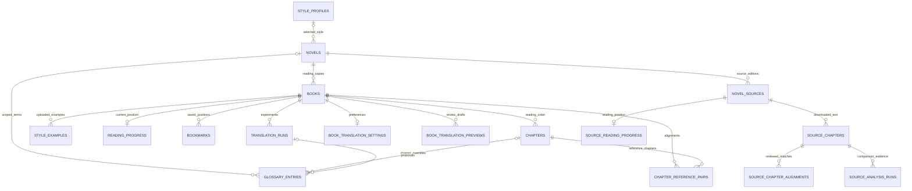

# Novelist Product and Engineering Plan

Updated 2026-09-11. This is the consolidated plan for the reader, scraping, reference material,
translation, and deployment. UI baseline commit: `51c3f38`.

## Current Delivery

This section records the current implementation and supersedes older source-pairing descriptions
below. The project evolved from multi-source novels into independent source books during this work.

Verification on 2026-09-11: 169 backend/shared tests with local Supabase and Docker enabled,
51 desktop/Android/iPhone browser workflows, and13 installed-extension workflows passed.
Application and extension builds, lint, database lint and patch whitespace checks passed.
The noun editor and reader screenshots were inspected on mobile. Model responses in tests were
mocked; read-only audits of saved user translations made no paid calls. Adaptive regular-API groups,
independent background reader jobs, bounded automatic retries, private hosting code, gzip files
and usage administration are implemented. Supabase CLI is now linked,55 schema migrations are deployed,
and the preserved hosted owner awaits email verification. Library-data/file migration, private GitHub
push and Render deployment remain pending. The discounted provider Batch API is not implemented or
live-provider evaluated. Built-in email-link login supports the Free project's default email provider.

| Requested                            | Implemented                                                                                                                                                                                                                                                                                                                                                                                               |
| ------------------------------------ | --------------------------------------------------------------------------------------------------------------------------------------------------------------------------------------------------------------------------------------------------------------------------------------------------------------------------------------------------------------------------------------------------------- |
| Separate reading editions            | Every reading source gets its own library book, inventory and source-owned text. Source URL/host and language identify similar titles. No reading-edition merge or pairing is required.                                                                                                                                                                                                                   |
| Migrate existing multi-source novels | Migrations012-016 applied. Two legacy secondary sources were converted after a private backup. Source IDs, files, progress and reviewed matches were retained; all659 chapter records present at migration were verified unchanged.                                                                                                                                                                       |
| Novel Updates attachment             | Optional series-URL field in the extension and Link Novel Updates in the book workspace. Catalogs can attach to multiple books without merging them. Saved catalog analyses can supply metadata; URL linking itself makes no model call.                                                                                                                                                                  |
| Library folders                      | Migration017; create, rename, delete, move books, All folders and Unfiled. One flat folder per book. Deleting a folder never deletes books.                                                                                                                                                                                                                                                               |
| Remove a source                      | Confirmed source removal, source-file cleanup and cleared affected preferences; other books, glossary and translation/style history remain.                                                                                                                                                                                                                                                               |
| Read downloaded chapters internally  | Chapter URLs open the reader, cached text is reused, uncached text downloads first. Source progress remains separate.                                                                                                                                                                                                                                                                                     |
| Reliable chapter inventories         | Deterministic dynamic/paginated scans, numbered first-chapter labels, URL deduplication, verified canonical aliases, retained longer inventories and visible save errors.                                                                                                                                                                                                                                 |
| Direct fetch and browser downloads   | Per-site Download method beside the extension chapter picker. Direct jobs use URLs without tab navigation; browser mode captures rendered pages. Pause, switch and resume retains the queue.                                                                                                                                                                                                              |
| Bulk all/range downloads             | App and extension direct fetches run1-3 concurrent jobs, default3. Direct pacing permits0seconds; rendered browser mode remains one tab with1-60second pacing. Global3-download/2-sandbox admission, duplicate cache recheck, out-of-order checkpoints, pause/resume and challenge stops. App Retry direct and Skip chapter controls avoid a stuck selection. |
| Rebuild extraction                   | Force regeneration bypasses cached code only with explicit model permission. Passing code replaces the cache; failed rebuilds preserve it. Direct tests use fetched chapter HTML and never overwrite downloaded text.                                                                                                                                                                                     |
| One-click translation                | With saved preferences, Translate immediately translates, saves and opens the chapter. Original switches back; navigation alone does not call AI.                                                                                                                                                                                                                                                         |
| Mass translation                     | Translate untranslated selects downloaded originals only across up to20,000 indexed chapters, keeps sparse original positions and excludes missing downloads; manual ranges up to1,000 remain strict. Reviewed count changes reject before starting. Adaptive groups of1-10, saved-version skips, independent reader jobs, three-attempt automatic retries and source/settings guards remain. Migration043 applied locally. |
| Average timings                      | Per-model/language averages across all measured history, with sample count and preparation/guide/generation breakdown. Unmeasured records and manual edits excluded. Range estimates use up to100 recent measured samples for the selected model/language.                                                                                                                                                |
| Retranslation/history                | Retranslate creates another saved version. Latest20 matching versions are selectable; old rows remain. Cached versions match source ID, URL, text hash and language.                                                                                                                                                                                                                                      |
| Paragraph formatting                 | Separate paragraphs, blank-line normalization, margins and deliberate internal line breaks. Collapsed multi-paragraph responses are rejected.                                                                                                                                                                                                                                                             |
| Another book as context              | Owned WEB/EPUB/TXT books can supply recent earlier chapters or style-only context without merging inventories. Matching controls are removed; historic matches remain stored.                                                                                                                                                                                                                             |
| Models and concurrency               | Separate per-book translation/chat model choices; Luna translation default, GPT-4.1 mini chat default. Eight concurrent local AI tasks by default, configurable1-32; optional hourly cap. Source download pacing and sandbox limits remain separate.                                                                                                                                                      |
| Rolling128k context                  | Configurable32k-128k total application budget, default128k with16,384 output reserve. Default3 recent full saved translations, configurable1-10. Older optional context is removed first above80% input pressure. Source, glossary and guide are retained.                                                                                                                                                |
| Evolving style guide                 | Bounded replacement guide from older generated translations outside the recent window and downloaded reference examples, plus prior guide and reader feedback. At most8 examples/32k characters per update and6k guide characters. Exact version/hash coverage and before/after comparisons are available in Style Guide.                                                                                 |
| Configurable auto-compaction         | Off by default; explicit paid authorization enables an update after N new translated chapters, default5 and configurable1-100, or context pressure. No new examples/feedback means no guide call. Retranslations and manual edits do not advance the counter.                                                                                                                                             |
| Requests to the guide                | Guide request, saved context/cadence preferences, coverage and last5 guide versions in the dedicated Style Guide tab. Automatic updates were explicitly enabled for the user's current Novel543 book; global defaults remain opt-in.                                                                                                                                                                      |
| Detailed noun/name extraction        | Prompt covers people, aliases, factions, places, species, items, ranks, abilities and techniques, with exact source evidence and complete compounds. Translation and extracted proposals are saved atomically.                                                                                                                                                                                            |
| Consistent terminology               | Approved book/global rules and explicitly selected other-book glossaries, labeled by language pair and category. Chapter > book > selected glossary > global precedence. Regional language tags/aliases supported. Search covers all glossary pages, notes/evidence/categories;25 rows per page. No silent100-approved-term cutoff.                                                                       |
| Reader-selected suggestions          | Highlight source/translated text and Suggest term; save an approved book or global preference. Earlier glossary choices are shown for review.                                                                                                                                                                                                                                                             |
| Inline term corrections              | Source and translated terms use script-aware boundaries. Supported English noun inflections are annotated and preserved during edits. Shared translated labels open a mapping review instead of guessing. Saved glossary context supplies established mappings omitted by the model. Chapter terms lists new/established/differing entries and annotation gaps.                                           |
| Contextual AI term suggestions       | Optional billable Suggest with AI uses the full current original, selected translation when available, exact/alias/similar terms from this book and selected glossaries, and a reader context box. Strict structured recommendations include evidence and alternatives; choosing and saving remain separate actions.                                                                                      |
| Completion/failure handling          | Raw status/refusal checked before validation; partial chapters never saved. Complete grouped objects can be salvaged without JSON repair. Single output16,384; grouped Luna ceiling65,536, GPT-4.1 32,768, GPT-4o mini16,384. Invalid terms produce warnings. Bounded retries for transient/invalid results; quota/access/source changes and exhausted attempts stop. |
| Exact resume                         | Original and translated chapter/language/version/scroll checkpoints persist separately; book/library Continue uses the newest reading activity. Observed timestamps reject late writes. Immediate-scroll navigation, refresh and local-cache removal are tested.                                                                                                                                          |
| Minimal reader UI                    | Chat/Search in the header; top and bottom Previous/Next; Contents left, centered Original/Translate, Settings alone at bottom right. Light/dark inside Settings. Reading scrollbar hidden without disabling scrolling. Contents opens centered on the active chapter's page.                                                                                                                              |
| Simplified book/workspace            | Book tabs: Contents, Downloads, Translate (source books), Bookmarks, Metadata. Metadata actions aligned; Edit in three-dot menu; no WEB/status badge. Downloads defaults to first missing chapter and has no disclosure panels. Translation Settings has preferences only; glossary, guide and metadata have dedicated tabs.                                                                              |
| Reader chat/retrieval                | Existing read-only cited chat and bounded PostgreSQL full-text retrieval remain available. Index terms/offsets refer to saved text, not duplicate prose; Chinese segmentation and selected-glossary query expansion supported. Current focus is translation reliability, not additional chat features.                                                                                                    |
| Next-chapter blank state             | Missing translations show original text and the correct switch state instead of an empty page; the next chapter remains navigable.                                                                                                                                                                                                                                                                        |
| Cost/privacy safeguards              | Owner RLS and private storage; confirmed paid actions, separate opt-in automatic guide work, token estimates and actual usage, no SDK retry, cached sandbox extraction and manual challenge handling.                                                                                                                                                                                                     |
| Persistent jobs                      | Occupied AI slots wait without consuming attempts. Development reloads retain worker state. Auth refresh in any open view renews workers; interrupted authorized jobs recover on reconnect within attempt limits. Reader completion never redirects another book. Manual pauses stay paused; free-host shutdown/token expiry can still delay work. |
| Admin and storage                    | Settings > Admin & usage: request-level estimates, unknown charges, quota errors, monthly alert threshold and jobs. Alert is not a hard spending cap or provider balance. New chapter files gzip when at least10% smaller; bounded decoding retains original hashes. Existing PostgreSQL TOAST/pglz kept after size comparison. |
| Private hosting preparation          | Standalone Node API/static server, password/email-link/code sign-in, preserved owner UUID, restrictive RLS/Storage, Free Render template and private backup/manifest. Hosted schema deployed; owner verification, library-data transfer and GitHub/Render publication still pending. See note.txt and deployment.md. |

### Limits and Research

- Parallel rendered-browser workers, unattended recurring schedulers, vector embeddings,
  recommendation agents, economy provider-Batch mode and whole-book translated exports are not
  built. Immediate grouped/reader queues and bounded automatic recovery are implemented. Starting
  a job authorizes retries; SDK retries remain disabled to avoid multiplying those attempts.
- Auto-extracted glossary entries remain proposed until reviewed. Reader corrections are explicit
  approvals. A style guide is not a plot summary and should not learn unreviewed translation errors.
- Recent generated translations provide continuity; older saved translations now also feed the
  guide. Generated prose is not authoritative story evidence. Compaction does not rewrite stored text.
- Hosted phone access is selected but not deployed. See [Private Hosted Novelist](deployment.md)
  for the single-owner Auth, API and exact data/file migration gates.
- The128k budget is an application policy, not a certified model limit. o200k_base estimates include
  a prompt allowance and output reserve; provider context support must still match the configured model.
- The3-chapter window/5-chapter guide cadence are conservative defaults tested with synthetic inputs
  and mocked model responses, not a claim of literary-quality optimization on live novels.
- OpenAI's [compaction guidance](https://developers.openai.com/api/docs/guides/compaction) says the
  input still must fit when compacting, and native compaction output is opaque. We use an inspectable
  saved guide so it can be reviewed and edited. [Prompt caching guidance](https://developers.openai.com/api/docs/guides/prompt-caching)
  favors stable instructions and acknowledges compaction can change cache reuse; no cache-hit rate is promised.
- The inspected Freewebnovel chapter121 uses "Soaring Mirage Serpent". That is an observed reference
  rendering, not an automatically approved glossary entry or evidence that every similar compound is equivalent.

## Translation Reliability and Bulk Investigation

### Observed Data

A read-only audit of12 recent non-manual translations of the user's Novel543 book on2026-09-11
found17,589-18,483 input tokens (average18,050),2,579-3,958 output tokens (average3,007), and about
2,444 source characters per chapter. The six newest sampled outputs had recorded `completed`
status; older previews did not store that status. These measurements do not prove literary
completeness or rule out earlier failed requests, which were not durably logged.

The observed missing underlines included plural forms of canonical English terms in chapters128/129
and shared labels in129/131. The renderer now handles those cases explicitly. A JSON schema alone
cannot ensure every useful noun is extracted; source evidence, actual target occurrences and the
chapter-term review UI remain necessary.

The previous generic translation error covered provider failures, JSON parsing and glossary
evidence errors. Those are now separated. Vite restarts while server code is edited can also
interrupt in-flight local requests. There is no evidence establishing one cause for every old
failure, and retrying a timed-out call can incur additional provider cost.

### Recommended Bulk Strategy

1. **Reading ahead (implemented):** a resumable queue uses adaptive groups up to10 or1 chapter per
  request. Successful chapters and queue results commit together; the next request uses newly
  saved recent context. Separate reader jobs run alongside bulk work on other chapters; running
  overlaps are shared and later valid saved results skipped.
   Independent books can use existing AI concurrency slots. Tables `translation_batches` and
   `translation_batch_chapters` retain progress across reloads; exclusive five-minute worker leases
  stop duplicate processing. Transient errors and interrupted jobs recover within3 total attempts;
  manual Pause/Cancel is retained. The worker runs in Node/Vite or the standalone production server,
  not a recurring scheduler. Expired browser
   authorization can pause a long queue; credentials are never written into the queue tables.
2. **Backlogs/cost:** OpenAI Batch supports `/v1/responses` and documents50% lower costs for
   supported models with a24-hour completion window. Use one chapter per `custom_id` and map
   responses by that ID, never by result order. Each chapter keeps its own completion check,
   source hash, model/prompt/guide/glossary snapshot and saved version. Batch model availability
   and account quotas must be checked for the selected model, including Luna.
3. **Grouping several chapters in one response (implemented):** adaptive1-10 with source/ID/output budgeting.
   A shared prompt may reduce repeated input, but there is no per-request fee to eliminate and
   no automatic discount from grouping. Output tokens remain proportional to translated text.
  Luna uses a65,536 application output ceiling (documented model maximum128,000), GPT-4.1 32,768
  and GPT-4o mini16,384. Unknown models default to16,384 unless explicitly configured after
  verification. Source tokens times2.5 plus3,072 per chapter estimate output headroom, and the
  total32k-128k application budget still applies. A fixed N alone is not a sufficient safety check.

Strict grouped output includes source keys/hashes, completion markers and ordered paragraph IDs.
Only fully closed chapter objects are recoverable after provider `max_output_tokens`; each is
independently validated/committed. Missing, duplicate, mismatched or incomplete chapters are not
published; malformed JSON and refusals are rejected, not repaired. Automatic retries use smaller
groups for unfinished chapters, preserve complete versions and stop at the attempt cap. Structural
coverage cannot prove semantic completeness or literary quality.

Groups share pre-group recent/reference/style context plus per-chapter glossaries. New translations
and opt-in guide updates affect the next request. A10-chapter group can pass a5-chapter guide cadence;
choose1 for per-chapter continuity. Per-chapter timing/token averages divide group usage equally,
not as exact individual latency/billing. Admin usage records one row per provider request and
includes retries, token-truncated responses and unknown charges; it does not invent historical costs.

Batch requests execute independently. Freeze the compatible guide/glossary at submission and
process in waves if continuity updates are important; later requests cannot depend on outputs
that did not exist at submission. Prompt caching can already reduce repeated input costs, so
measure cached usage before claiming an additional grouping saving. The provider's batch-wide
quota statement is not permission to exceed each model's per-response output limit.

The queue reuses existing context preparation and guarded saves with grouped regular Responses
generation. No paid bulk experiment or discounted provider Batch submission was made.
Functional tests use mocked providers and real local Supabase. Actual price/quality/speed
comparisons need a small user-authorized evaluation. Cost review uses the recorded average for
chapter estimates and a conservative input/output-budget ceiling, including configured guide
updates. Saved candidates are always revalidated before spending; no cache-hit or price guarantee
is implied by the preflight count.

References checked2026-09-11:

- [Structured outputs, incomplete responses and refusals](https://developers.openai.com/api/docs/guides/structured-outputs)
- [Batch discount, supported endpoints, completion window and result IDs](https://developers.openai.com/api/docs/guides/batch)
- [GPT-4o mini:16,384 maximum output tokens](https://developers.openai.com/api/docs/models/gpt-4o-mini)
- [GPT-4.1 mini:32,768 maximum output tokens](https://developers.openai.com/api/docs/models/gpt-4.1-mini)
- [GPT-5.6 Luna:128,000 maximum output tokens](https://developers.openai.com/api/docs/models/gpt-5.6-luna)

## Product Goal

A personal library for Chinese webnovels, especially wuxia and xianxia: add a novel URL, obtain
its metadata and synopsis, capture chapters, translate them, and read from the place last saved.
Prioritize the next unread chapters or process a backlog in bounded parallel batches. A novel
may have thousands of chapters and multiple original, mirror, and translated sources.

Continue from chapters already read in English while preserving names, terminology, and broad
translation conventions from authorized reference examples. Full novels and many chapters may
form the reference corpus; this must not be reduced to a few manually written prompt examples.
The corpus is stored and retrieved, not implicitly used to train the model.

## Reader and Interface

- Minimal neutral gray/charcoal library with mobile ergonomics, not a discovery or marketing page.
- No sign-in screen for local use; no profile/avatar circle or workspace/storage dashboard clutter.
- Keep all three Gutenberg examples and the original synthetic Qinglan Crossing test novel.
- Keep the current-book strip consistent across shelf tabs; filter only the collection beneath it.
- One plain settings gear at the top-right opens appearance choices and reading preferences.
- Reading settings use a full-height side panel on desktop and a full-height screen on phones.
- Top/bottom chapter navigation and final-book completion; the footer has no duplicate position labels.
- Translation opens on Settings, with Style Guide, Glossary and Metadata alongside it. Settings
  contains preferences only. Chapter translation happens in the reader; metadata is separately reviewed.
- Guide instructions/versions/coverage and comparisons are inspectable. Chapter examples remain
  in a secondary Examples view. The term-extraction development harness remains separate.

## Decisions

- Personal library first, no public catalog. Preserve the minimal mobile reader.
- OpenAI models for initial production translation and structured review. Luna is a configurable
  extraction candidate, not a proven literary translator. Do not assume benchmark quality from schema support.
- Open-weight Qwen models are comparison candidates for later experiments on rented compute.
- Store source files and outputs in private Supabase Storage; structured state belongs in Postgres.
- Keep all existing public-domain samples. Use synthetic bilingual material for initial functional tests.
- A title match is a candidate identity link, never sufficient evidence to merge novels automatically.
- The eventual scraper service is generic: a requested output schema plus seed pages, not novel-specific code.

## Historical First Slice

The following implementation history records earlier designs. The Current Delivery and reliability
sections above are authoritative when an older pairing, draft, UI or limit description conflicts.

| Component                | Current Behavior                                                                                                                                                                                                                     |
| ------------------------ | ------------------------------------------------------------------------------------------------------------------------------------------------------------------------------------------------------------------------------------ |
| Canonical novels         | Every imported reading copy links to a novel with original title, aliases, and author. Existing books were migrated without deleting content.                                                                                        |
| Source records           | The UI lists and adds URLs only; linking does not fetch a page. Original/reference metadata, rights provenance, editions, and stored file paths remain preserved in Supabase.                                                        |
| Source preferences       | Per-book target language, main chapter source and main-page metadata source. Inventories remain edition-specific, including unequal counts.                                                                                          |
| Reference books          | Any other imported book with stored chapters; same-novel or style-only mode. Chapter-number/title suggestions and editable one-to-many/many-to-one pairs.                                                                            |
| Retrieved context        | Paired/suggested chapters or a preceding window, bounded to 24,000 characters; approved glossary and selected style profile. No-model preview with hashes and warnings.                                                              |
| Metadata previews        | Copy a saved source identification or translate title/synopsis, then explicitly apply title, author, synopsis and available cover. Concurrent book/settings edits invalidate the preview.                                            |
| Chapter drafts           | One confirmed model request for a stored chapter, structured paragraphs and grounded terminology candidates, saved context/usage, TXT download and source-reader playback.                                                           |
| Glossary                 | Global, novel, and chapter scope; meaning, category, aliases, evidence, proposal status, optimistic revisions and selected target-language filtering/saves.                                                                          |
| Chapter examples         | Private UTF-8 TXT uploads, content-hash deduplication, selection, and removal.                                                                                                                                                       |
| Style profiles           | A confirmation-gated OpenAI request infers a new read-only profile from selected examples, with exact evidence quotes and model/prompt/hash snapshots. Existing profiles remain selectable.                                          |
| Run history              | Model, mode, task, prompt version, source text hash, source path, glossary revisions, style snapshot, result, token usage, timestamps, and failure state.                                                                            |
| Page identification      | Selectable output language (English default), automatic source-language detection, translated metadata, multiple synopses, covers and unmatched attributes. No initial evidence-quote gate; navigation safety remains separate.      |
| Identification snapshots | Owner-isolated structured fields and raw extraction JSON in `page_identifications`, including source/output languages, provenance hash, model/prompt version and cost/usage.                                                         |
| Contents discovery       | One Scan & save chapters command opens the same-site index, uses deterministic expand/order/pagination controls, collects 500-link batches and saves to the existing/new novel. No model planning; partial coverage remains visible. |
| Site reuse               | Successful navigation recipes and sandbox-validated scraper code persist by owner and exact site origin. Navigation rematches observed controls; scraper code is retested before reuse and repaired on failure.                      |
| Reviewed web library     | Add/explicitly update a metadata-only WEB entry from a stored identification. Paired translated-edition URLs share its canonical novel and appear in Novelist. No chapter bodies or downloads are fabricated.                        |
| Term extraction          | A localhost-only authenticated experiment reads a stored Chinese chapter, validates structured terms, then atomically stores proposals and completes the run.                                                                        |
| Review                   | Explicit individual approval/rejection. Re-running extraction does not overwrite approved terms or duplicate active proposals with the same meaning.                                                                                 |

The real sources for The Time Machine, Alice's Adventures in Wonderland, and The Secret Garden
are recorded as Project Gutenberg editions with their canonical URLs. Their source pages list
public-domain status in the USA. Preserve original file notices and check other jurisdictions.

Qinglan Crossing is an original, synthetic three-chapter Chinese fixture with a paired English
reference. Both were created by the coding assistant during development. They are not a published
novel, a professional human translation, or an independent model-quality evaluation corpus.
The Chinese book appears in the library; the paired English reference remains in private Storage
and source metadata. It has no URL, so it is not displayed in the simplified Sources tab.
The deterministic fixture extractor is an internal test harness and makes no API request.

## Data Model

All relationships include owner identity, not just resource IDs. RLS applies to all tables and
Storage access. Global glossary entries have no novel/chapter foreign key; chapter entries require
an existing chapter in the same novel. Proposed/rejected entries never become translation defaults.
The same Chinese spelling with a different meaning remains a distinct glossary entry.

Precedence: approved chapter override > approved novel term > approved global default, for the
same source language, target language, spelling, and meaning. Context matching still needs evaluation;
simple substring retrieval in this experiment is not a complete entity-linking solution.

Books are currently content-hashed imported reading copies, not immutable source revisions. Source
records distinguish editions but do not yet share a normalized edition object across mirror sites.
Source chapter bodies now have an owner/source/URL identity, private content-hashed files and capture/
scraper provenance. Direct HTTP download and a rendered extension fallback publish validated text
without altering imported files. Manual and model-proposed split/merged pairs remain source-specific.
No automatic source merger, corpus-wide alignment or whole-book translated edition export is implemented.
Linking a URL still stores metadata only; downloading is a separate operation.

## Current Download Workflow

Book details have a reading-source selector, independent chapter inventories/download counts and
per-source resume. Novel Updates is shown separately as a catalog. Chapter rows open internal text;
uncached chapters download automatically, with explicit confirmation before scraper generation/repair.
The reader preserves its typography, settings and previous/next controls and links confirmed reference
chapters. Saved chapter translations now open in the same reader; downloaded-source bookmarks remain future work.

Ranges start at the first missing chapter and suggest five positions, up to20,000; Download all uses
the entire saved inventory. Direct fetching uses1-3 workers with no forced one-second backend delay.
Stop finishes current requests and prevents new dispatch; successes persist and retries skip stored
text. Browser downloads retain one-tab navigation and separate site pacing. The app queue remains
foreground, not a durable scheduler. Direct fetch uses the pinned public-address
fetcher with no cookies or redirects and1MB/eight-second caps. Scrapers are
revalidated in Docker; one confirmation permits one generation/repair cycle of at most three calls.
Chapters may span at most five source pages/160,000 text characters/2,000 paragraphs; no partial
chapter is saved on failed pagination. Obvious verification pages stop before model use.

The extension's primary chapter action is Download chapter; its extraction test is a tooltip-labeled
icon. Captured HTML is saved through the same owner/source inventory validation, never directly from
an arbitrary URL. For multi-page chapters, later pages currently use direct HTTP; if those pages need
browser rendering, the download stops without partial publication. No access checks are bypassed.
Live direct-access check on 2026-09-11: Freewebnovel chapter one returned 31,232 filtered HTML characters;
101kks chapter one returned HTTP 403, requiring the extension path. No paid generation/evaluation was run.

The extension now has a per-site Download method selector for direct URL fetching or browser pages.
Successful direct extraction tests select HTTP automatically; older test results can be switched
manually without rebuilding. URL-only single and bulk jobs use the same authenticated downloader,
source inventory validation, cached adapters, consent gates and checkpointed batch queue. No tab is
navigated in direct mode. Paused queues can switch methods after the in-flight job finishes.

The vampire source's755-entry inventory included its homepage as an unnumbered chapter. A guarded
local metadata repair removed that entry after backup, retaining752 stored chapter paths/hashes and
the final chapter/afterword at positions753-754. Two read-only guarded fetches verified those last
URLs without paid model calls. The inventory-discovery regression excludes the parent homepage but
retains genuine end matter. The repair did not copy files or alter translated text.

Book-page direct extraction tests bypass chapter cache without overwriting text. Forced scraper
regeneration bypasses adapter reuse but replaces it only on validation success. Direct tests stop on
fetch/challenge errors before model use. One successful sample does not establish whole-site coverage.

Translation > Sources now supports confirmed removal of one source. Migration202609110011 removes
the owner-scoped source and cascaded chapter/pairing/progress records, clears affected settings with
a revision increment, and deselects continuation guides based on that source. Current private chapter
files are then deleted through Storage. The novel, other sources, imported files, glossary and saved
translation/style history remain; the library does not reconstruct deleted original-source links.

## Current Reference Workflow

Open Translation > Setup and save the target language, main chapter source and metadata source.
Sources may have different counts; choosing the main source changes the translation chapter selector,
not the original reader inventory. A linked Novel Updates catalog can supply main-page metadata through
an explicit preview/apply step. Metadata translation is optional and requires one confirmed model call.
Title, synopsis, author and an available cover can be applied; original source data remains retained.

Select another reading source of the same novel as Reference source, or retain an imported EPUB/TXT
reference. Source pairings use source IDs and URLs, with proposed/confirmed/rejected review states.
Desktop comparison shows both downloaded texts; phones retain reading and translation. Number/title
matching is an unverified suggestion; one source chapter may map to 20 reference chapters and a reference
chapter may be reused for multiple source chapters. Rejected source matches persist across analysis
reruns. The legacy imported-book pair editor still restores suggestions when a pair is cleared.
The source-pair editor now uses searchable checkboxes, per-chapter download status and an explicit
Confirm & save pairing command. Saved split-pair edits survive reloads and late responses cannot
overwrite newer selections. A source with one downloaded English chapter cannot confirm later
chapter pairs until their reference text is stored.

An explicitly confirmed analysis compares one downloaded source chapter (18,000 characters maximum) with
1-5 selected references (40,000 characters total), using the identification model, nano by default. Returned
URLs must be supplied candidates; terminology needs literal source evidence and target terms within
exact matched-reference quotes. Snapshot, result, proposed pairing and deduplicated novel-scoped glossary
proposals are saved atomically under settings revision checks. Existing reviewed pairs and glossary
entries are preserved. This bounded comparison is not a semantic index or a literary-quality benchmark.

Context preview retrieves actual private chapter text without a model request. Setup source references use
confirmed pairs, while imported books retain suggested/preceding context. The reader's continuation mode
uses recent earlier downloaded English chapters without pairing. It is chapter-aware retrieval,
not embeddings or semantic search over the entire corpus. Excerpts total at most 24,000 characters,
with at most 8,000 per reference chapter and truncation warnings. The full reference remains stored.
Reference-language mismatches and unconfirmed pairs are visible. The source remains authoritative.

A stored source chapter up to 18,000 characters can produce one review draft after confirmation.
The server snapshots source/reference hashes and text, settings revision, approved terminology,
style, result, model and usage. Draft output is downloadable and can be read from its source chapter.
Glossary candidates are grounded in source text and remain separate from approved glossary entries.
Translation now extracts categorized noun/name candidates within the same request and saves them
as proposed glossary entries atomically with the draft. Exact source evidence and literal target
occurrence in the translated paragraphs are required. Existing reviewed entries are not overwritten;
reruns deduplicate by novel, scope, language pair, source spelling and sense. Schema migration009
adds complete_chapter_translation with settings-revision checks and transaction rollback on invalid
evidence. Legacy draft previews remain readable.
WEB chapter URLs can now be downloaded, then translated. Bounded download ranges are implemented;
durable background processing and whole-book translated edition exports remain pending.

### Reading-First Continuation

The source reader has Translate & read, language/reference selection, and saved translation reuse.
Saved results must match source ID, URL, source text hash and target language. Reload and previous/next
preserve translation mode; missing translations require a new explicit request. Original text and
source reading progress are not overwritten. Translated checkpoints are browser-local for now.

For chapter 123, continuation retrieves the last three downloaded numbered reference chapters below
123, even with no confirmed pairs. Missing reference downloads are skipped and future chapters excluded.
The optional compact reading guide accumulates earlier reference coverage through explicit updates,
each bounded to eight chapters/32,000 characters plus the prior guide. A complete replacement guide
is at most 6,000 characters; every new chapter needs exact evidence. No plot facts or distinctive
phrases should be carried into the guide. It does not replace the approved bilingual glossary.

POST /api/ai/reading-guide checks coverage without a model call unless confirmed. A confirmed update
uses one configured-model call, no SDK retry; no pending coverage makes no call. Migration010 atomically
creates/selects a version under expected settings/profile checks. Metadata records URLs, stored hashes,
cutoff, prior profile, evidence and usage. Changed hashes, reference, language or an earlier cutoff
prevent reuse. Oversized chapters fail without truncation. Tests use real private Storage/RPCs and
mocked model responses; neither guide quality nor live translation quality has been evaluated here.

## Current Style Workflow

1. Start local Supabase and the Vite development server.
2. Open a book, then Translation > Style. Select downloaded English chapters and Use as style
   examples, or upload UTF-8 `.txt` files. Both create private, content-deduplicated text snapshots.
3. Select examples and choose Infer style. Confirm permission to send them to OpenAI before a call.
4. Inspect the read-only result and its evidence. A new profile is created and selected atomically,
   and automatically included in future translation requests. Saved profiles remain reusable.
5. Manage URLs under Sources and terminology under Glossary. Prior experiment records remain in Studio.

Uploads work without AI configuration. Each file can contain up to 200,000 characters and 1 MB.
One inference uses at most 12 examples and 48,000 characters, with no silent text truncation.
The server checks ownership, stored content hashes, exact quotes, coverage of every selected file,
and concurrent changes to the selected profile. English-only examples establish prose preferences,
not bilingual fidelity. Large-corpus style distillation remains a separate milestone, not a claim
about what this bounded first inference can do.

For a live trial, configure `OPENAI_API_KEY` in the ignored local environment, set
`NOVELIST_ENABLE_LIVE_AI=true`, and restart Vite. `OPENAI_EXTRACTION_MODEL` defaults to
`gpt-5.6-luna`; verify availability for the account before a paid trial. The model must support
Responses structured outputs and the selected reasoning setting. Do not place these secrets in
`VITE_` variables or browser local storage.

Live mode requires confirmation before a billable request. Style inference and internal extraction
share one active request per library and 20 attempts/hour per server process. Extraction accepts
18,000 source characters and 100 relevant approved terms; both tasks allow at most 2,400 output
tokens. SDK retries are disabled.
These are development safeguards, not distributed production quotas or a guaranteed dollar cap.

The endpoints verify the user's Supabase token and read with that user's RLS permissions, never
a service-role key. They reject cross-origin requests. Internal extraction also rejects unsupported
modes, non-Chinese sources, unreviewed rights, and altered fixture chapters.
Chapter text and supplied context are untrusted data; they cannot choose the model or tools.

The user has run live identification and scraper experiments. The reference/draft implementation
and automated tests made no additional paid calls; provider responses are mocked. These tests
establish behavior and isolation, not literary quality, current model access or production latency.

## Scraper Experiment

### Download Experiments

Run `npm run benchmark:downloads` for a local Playwright render/capture comparison. The script uses
the bundled DOM registry, 16 synthetic chapter pages and 200 ms artificial response latency. It never
contacts a public novel site or runs model inference. It excludes Supabase saves, Docker extraction,
production pacing and real-site network conditions, so these are not whole-pipeline throughput claims.

Measured on 2026-09-11:

| Fixture                    | Workers | Completed | Elapsed | Challenge Responses |
| -------------------------- | ------- | --------- | ------- | ------------------- |
| No challenge               | 1       | 16        | 3.812 s | 0                   |
| No challenge               | 2       | 16        | 1.932 s | 0                   |
| Challenge after chapter 10 | 1       | 10        | 2.638 s | 1                   |
| Challenge after chapter 10 | 2       | 10        | 1.486 s | 2                   |

Two workers overlap latency in the unrestricted fixture, but do not improve coverage after access
is denied; both in-flight workers can encounter the challenge. This does not predict Cloudflare's
actual rules. Do not enable parallel production traffic on the challenged 101kks source based on
this result. Keep sequential checkpointed downloads, measure browser versus extraction/save timings,
use adjustable per-site pacing and stop for manual challenge resolution. No proxy rotation, cookie
forgery, CAPTCHA solving or anti-detection browser configuration was added. Playwright already exists
in the project; adding Selenium would not change the site's access decision.

The user's stored vampire-novel state at inspection contained 26 Chinese chapters, one English chapter,
one confirmed pair and no selected style profile. That state was inspected read-only; no paid translation,
style inference or high-volume live-site experiment was run during this implementation.

The developer-run harness is implemented alongside the initial reference/draft workflow,
without another reader tab. It produces actual JavaScript scraper code through the provider adapter,
not selector configuration, and runs it in Docker with a bounded test/repair loop. The plugin-facing
tool accepts captured DOM and URLs. A Chrome/Edge side-panel extension now identifies the page
before a separately confirmed one-chapter extraction test. Scan & save chapters gathers and stores
the link inventory with bounded registered controls, without paid planning or chapter-body samples.
The earlier multi-sample/model-exploration engines remain internal, not the main panel workflow. See the
[experiment guide](scraper-experiment.md) for commands, API details, and measured fixture results.

The completed no-cost fixture run exercised real execution with a scripted generator: two attempts,
two passing training pages, and three passing held-out pages. It is not a live model or real-site
quality evaluation. The unpacked extension and short-lived pairing bridge are implemented;
live model/site evaluation and reviewed chapter import remain next. Existing data is retained.
Installation and the complete user workflow are in [browser-extension.md](browser-extension.md).
Initial identification defaults to GPT-5 nano, separately from scraper generation, with local
preflight token-price estimates and reported-usage estimates afterward. Model-price comparisons
are arithmetic for the same token counts, not paid benchmark runs or quality guarantees.
The extension now has a saved model preference and per-run override. Paired edition URLs can be
provided as context, but their text is not fetched or treated as translation examples automatically.
The app now has a global source-URL directory, and the extension can browse the connected library,
suggest local title/alias matches and optionally compare cross-language metadata/synopses with consent.
Reviewed pairing attaches a page to an existing canonical novel; it does not merge two existing books
or import chapter bodies. The separate no-model 101kks index check found 754 distinct chapter URLs
after expansion, in two batches. Live navigation-model and cross-language match quality remain unbenchmarked.
Captured Novel Updates series metadata can now be explicitly included in identification of another
page. Associated names feed matching and are retained on reviewed save/pairing, while original/English
publisher details remain structured metadata. Catalog URLs have a separate metadata source role;
release listings are not treated as direct chapter contents. The supplied live entry fit a scoped
20,273-character browser capture, with four associated names and publisher data retained. Its reported
753 original chapters are distinct from 754 observed 101kks URLs. No additional paid call was made.

### Question and Output

Can an agent given representative pages and an output contract generate an adapter that also
works on unseen pages from the same site, detect missing content, and repair a layout change?

The reusable input is a seed URL, allowed origins, requested output schema, representative HTML,
and an explicit run budget. The novel-specific contract initially contains:

- Novel title, author, original language, synopsis, canonical source URL, and chapter index.
- Chapters with source URL, title/number, ordered text paragraphs, and next-page/chapter candidates.
- Source-page hashes, capture timestamps, warnings, and evidence locating extracted fields.

The host owns fetching, pagination, retries, deduplication, normalization, and validation.
The generated adapter parses supplied pages and returns validated data plus proposed URLs;
it never receives application credentials or unrestricted browser/network access.

### First Run

1. Create original local HTML fixtures for a novel index, normal chapters, a split chapter,
   navigation/advertising noise, a missing chapter, and a changed layout. Keep an independently
   authored expected-output set and held-out pages inaccessible to the generator.
2. Define the typed adapter contract and Zod output validator. Use an established HTML parser
   such as Cheerio; use Playwright only when browser rendering is necessary.
3. Have OpenAI write JavaScript adapter code against that contract. Save the generated source,
   prompt version, model, inputs, and attempt metadata as inspectable artifacts.
4. Run the adapter in an isolated container: no network, no secrets, no host mounts,
   unprivileged user, read-only filesystem, and explicit memory/CPU/process/time limits. Node's
   `vm` is not a security boundary. Validate sandbox restrictions before running generated code.
5. Evaluate independent assertions for ordered chapter discovery, text preservation, pagination,
   valid URLs, and absence of site chrome. Feed only training-page failures back for at most
   two repair attempts; evaluate untouched held-out pages afterward without tuning to them.
6. If it passes, capture a small permitted public-domain source, initially a Gutenberg sample,
   through the host-controlled fetcher. Save raw responses and provenance, then repeat against
   a second permitted layout. A static Gutenberg success does not prove general webnovel support.

Implemented budgets: one allowed origin, 1-3 supplied captures, 80,000 characters per capture and
160,000 total; the CLI/tool itself makes no page requests. The extension bridge can sample at most
two explicitly selected links, one request in flight and at most one per second, with DNS/address,
redirect, size and time restrictions. Adapter execution allows five seconds, with one generation
plus two repair calls. Larger crawls need separate budgets and approval. Do not run paid calls when
the key is absent; a handwritten fixture adapter can test the harness but is not a generation result.

### Acceptance and Failure Cases

- All authored fixtures match the expected ordered paragraphs and links, including split pages.
- No omitted body paragraphs, duplicate chapters, unrelated navigation text, or invented content.
- Re-running capture/import is idempotent and preserves original raw pages and provenance.
- Off-origin/private-network/metadata-service destinations and unsafe schemes are blocked;
  validate DNS resolution and redirects, limit response bytes, and enforce timeouts in the host.
- Prompt instructions embedded in HTML remain data. Generated code cannot access host secrets,
  escape the sandbox, spawn uncontrolled processes, or bypass request limits.
- Login, paywall, CAPTCHA, throttling, or access restrictions yield a clear stopped/needs-review
  result. A browser session is not authorization to bypass restrictions.
- Record passes, failed assertions, repairs, source/code hashes, tokens/cost, and runtime. Report
  held-out results separately from training fixtures; no success claim from a model's self-report.

### Follow-Up After the Experiment

Persist approved adapter versions, source captures, and scrape jobs in Supabase. Publish normalized
chapters to the existing library only after review. Then add resumable jobs, changed-layout detection,
more sites, rendered-page capture, and the generic extension integration described below.
The generation runner, isolated sandbox, tool contract, capture helper, and fixture experiment are
implemented, along with extension pairing, metadata review, and bounded public sampling.
Metadata-only library publication and translated-version links are implemented. Live-site/model
quality evaluation and a durable crawl queue remain pending; bounded chapter-body downloads are implemented. Site adapter
reuse with fresh sandbox validation is implemented; the successful adapter is reused until it fails.

## After the Scraper

### 1. Evidence-Based Model Selection

- Build a consented/licensed Chinese-English benchmark with bilingual review. Start around 200
  diverse passages, plus 50-100 consecutive chapters and long-gap character reappearances.
- Keep held-out translations and every mirrored duplicate out of the prompt/retrieval corpus.
- Compare glossary-only, glossary plus style, and relevant aligned-example prompts. Include
  a stronger OpenAI translation baseline; try Qwen separately without switching the main pipeline.
- Measure semantic errors, missing/additional content, speaker/negation/number errors, terminology,
  style preference, correction effort, latency, and total cost per accepted chapter.
- Test cheap reviewers with deliberately corrupted translations; measure missed errors and false
  alarms. Self-reported model confidence and correct JSON are not sufficient evidence.
- COMET/XCOMET may supply secondary signals after license checks, never the only release gate.

### 2. Versioned Single-Chapter Translation

- Add immutable source revisions, addressable paragraphs, translation versions, and review issues.
- Store each result separately; keep an explicit published-version pointer for the reader.
- Record model, prompt, source revision, resolved glossary/style snapshots, output checksum,
  token/cost usage, and evidence spans for each finding.
- Preserve valid sentence/paragraph merging while detecting omissions and duplicated content.
- Repair only flagged sections and revalidate them. Never silently rewrite saved chapters after a
  glossary change. Let the reader opt into a newer version.
- A source-aware editing pass may improve English; it must not invent plot or erase authorial voice.

### 3. Many-to-Many Source Alignment

- Extend source editions into immutable captured pages and paragraph spans. Reconstruct pagination
  within an edition before aligning between Chinese and English.
- Candidate generation uses title/author aliases, order, known anchors, and multilingual embeddings.
- Evaluate an established aligner such as Vecalign, then use cheap structured review for ambiguity.
- Persist one-to-many/many-to-one/many-to-many mappings, gaps, version IDs, evidence, and review state.
- Distinguish missing content, split numbering, alternate translations, abridgments, and revised originals.
- Make source grouping and merges explicit and reversible. An imported reference can belong to the
  same novel without being considered interchangeable with another translation.

### 4. Large Reference Corpus

- Import full authorized books/chapters, deduplicate mirrors, and preserve translator/edition provenance.
- Add reference collections spanning different novels. Collection membership is not book identity.
- Distill per-edition style profiles and index aligned bilingual examples by passage type and problem.
- Retrieve relevant examples and entity facts at request time instead of sending the whole corpus.
- Scope story facts to preceding chapters to avoid future-plot leakage. Do not carry unrelated book
  characters or cultivation systems into the target novel.
- Turn accepted user corrections into a curated example set, with approval and provenance.

### 5. Durable Background Processing

- Add Supabase Queues job records, leases, attempt limits, backoff, cancellation, and reconciliation.
- Separate capture, normalization, extraction, translation, review, and publication stages.
- Parallelize bounded chapter windows after reconciling terminology and freezing context versions.
- Prioritize the next unread chapters; optionally batch the backlog after verifying model support.
- Enforce global/provider and per-source rate budgets across workers, not independently per book.
- Use idempotency keys based on source/model/prompt/context/task and reconcile interrupted calls
  before resubmitting. Queue delivery cannot guarantee exactly-once external model billing.
- Test a 1,000+ chapter run with failures/restarts. Operational success and literary quality are
  separate gates; monitor random passing chapters as well as flagged results.

### 6. Generic Scraper Agent and Extension

- Seed URLs + output schema -> adapter code + independent fixture tests + a versioned adapter.
- Use established HTTP/browser libraries; store representative page fixtures and held-out checks.
- Execute generated code in a hardened sandbox with no app secrets or unrestricted filesystem/network.
- A host-owned fetch/browser interface controls destinations, request budgets, and source rate limits.
- Revalidate layout changes. Stop on authentication, paywalls, or source restrictions rather than
  treating the user's active browser session as permission to bypass them.
- The extension provides approved DOM capture and navigation. Do not execute arbitrary remotely
  generated scraper code in a privileged, store-distributed extension.

## Before Hosting

Link the anonymous library to a recoverable identity for cross-device reading. Migrate the local
experiment handler out of Vite into a separately deployed authenticated API/worker; static builds do
not include that endpoint. Add distributed quotas, budget accounting, job recovery, secure transport,
source authorization, retention/deletion, and a credential policy before exposing a hosted service.
The current per-process limits and run records are not a durable production execution engine.

Deleting the final reading copy currently removes its novel workspace and source metadata; stored
shared style profiles and global glossary defaults remain. Broader corpus retention needs an explicit
policy before multiple independent reading copies and remote workers are relied upon.
